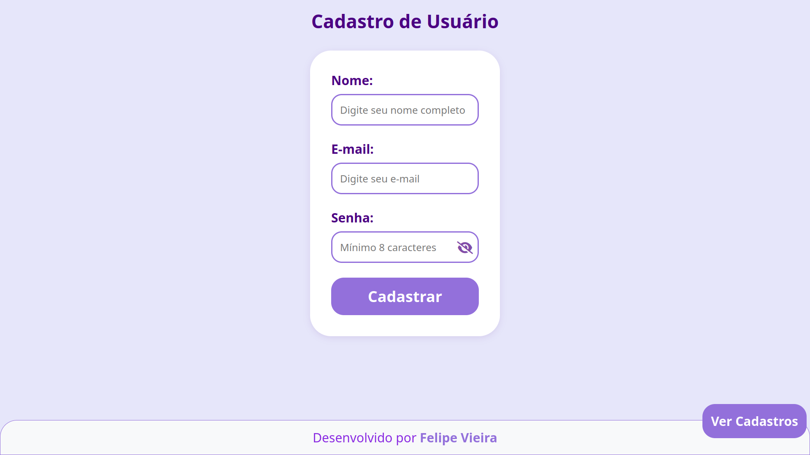
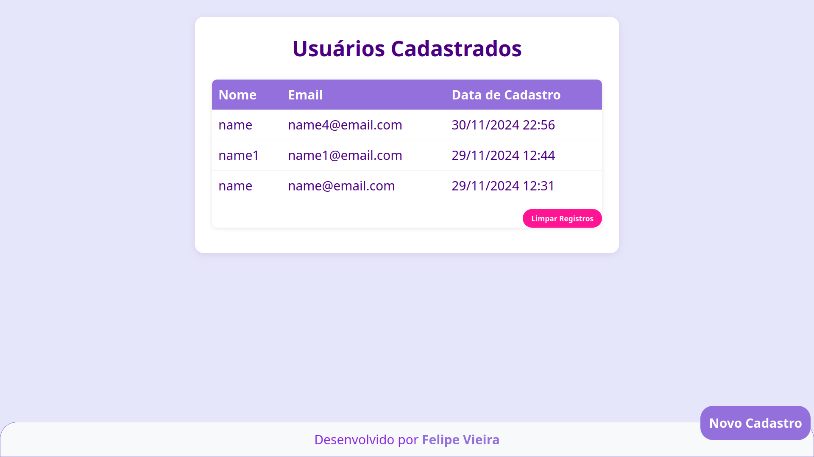

# Sistema de Cadastro de Usuários

Sistema moderno de cadastro e gerenciamento de usuários desenvolvido com PHP, MySQL e interface responsiva.

## Screenshots

### Página de Cadastro


### Lista de Usuários


## Sobre o Projeto

Sistema web responsivo para cadastro e gerenciamento de usuários, com foco em:
- Interface moderna e intuitiva
- Validação de dados
- Segurança
- Responsividade
- Organização do código

## Funcionalidades

### Cadastro de Usuários
- Validação dos campos
- Feedback visual
- Verificação de email único
- Proteção contra dados inválidos
- Interface amigável

### Listagem de Usuários
- Visualização responsiva
- Opção de limpar registros
- Ordenação por data
- Feedback de ações
- Navegação intuitiva

### Interface
- Design responsivo
- Animações suaves
- Fontes otimizadas
- Ícones modernos
- Layout intuitivo

## Tecnologias

### Frontend
- HTML5 Semântico
- CSS3 (Flexbox)
- JavaScript
- Font Awesome
- Google Fonts (Quicksand)

### Backend
- PHP 8.3.14
- MySQL/MariaDB
- PDO
- Prepared Statements

### Segurança
- Validação de dados
- Proteção contra SQL Injection
- Sanitização de inputs
- Verificação de duplicidade
- Feedback de erros

## Requisitos

### Servidor
- PHP 8.3.14
- MySQL/MariaDB
- Servidor PHP Built-in

### Cliente
- Navegador moderno
- JavaScript habilitado
- Conexão com internet

## Instalação

1. Clone o repositório
```bash
git clone https://github.com/felipevieir4dev/SITUACAO-PROBLEMA-3.0.git
cd SITUACAO-PROBLEMA-3.0
```

2. Configure o banco de dados
```sql
-- Execute o script em database/schema.sql
CREATE DATABASE IF NOT EXISTS db_usuario;
USE db_usuario;

CREATE TABLE IF NOT EXISTS usuarios (
    id INT AUTO_INCREMENT PRIMARY KEY,
    nome VARCHAR(255) NOT NULL,
    email VARCHAR(255) NOT NULL UNIQUE,
    senha VARCHAR(255) NOT NULL,
    data_cadastro TIMESTAMP DEFAULT CURRENT_TIMESTAMP
);
```

3. Configure as credenciais
```php
// Edite config/config.php
$host = 'localhost';
$dbname = 'db_usuario';
$user = 'root';
$pass = '12345678';
```

4. Inicie o servidor
```bash
php -S localhost:8000 -t public
```

## Uso

### Cadastro
1. Acesse http://localhost:8000
2. Preencha o formulário:
   - Nome completo
   - Email válido (único)
   - Senha
3. Aguarde confirmação

### Listagem
1. Acesse http://localhost:8000/listar
2. Visualize os registros
3. Use "Limpar Registros" se necessário
4. "Novo Cadastro" para voltar

## Estrutura do Projeto

```
SITUACAO-PROBLEMA-3.0/
├── config/
│   └── config.php           # Configurações do banco
├── database/
│   ├── README.md           # Documentação do banco
│   └── schema.sql          # Estrutura do banco
├── public/
│   ├── assets/
│   │   ├── css/
│   │   │   ├── cadastro.css
│   │   │   └── listar.css
│   │   ├── favicon/
│   │   └── images/
│   └── index.php
├── src/
│   ├── controllers/
│   │   ├── cadastrar_controller.php
│   │   ├── listar_controller.php
│   │   └── limpar_controller.php
│   └── views/
│       ├── cadastro.view.php
│       └── listar.view.php
└── README.md
```

## Banco de Dados

### Tabela: usuarios
- id (INT, AUTO_INCREMENT, PRIMARY KEY)
- nome (VARCHAR(255), NOT NULL)
- email (VARCHAR(255), NOT NULL, UNIQUE)
- senha (VARCHAR(255), NOT NULL)
- data_cadastro (TIMESTAMP, DEFAULT CURRENT_TIMESTAMP)

---

<div align="center">
  <p>
    By Felipe  Vieira
  </p>
  <p>
      
  </p>
</div>
